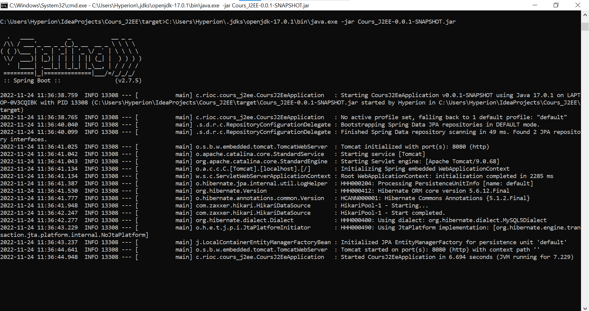

Cours_J2EE
---

API REST développée pendant le cours de Java J2EE à l'Unilasalle Amiens.
Vous trouverez dans cette documentation toutes les informations nécessaires
à l'installation de l'environnement de développement et au lancement de
l'application.

# Lancer l'application (sans environnement de dev)

Un fichier JAR se trouve dans le dossier `target`. Il s'agit d'une version
autonome du projet.

Vous pouvez l'éxecuter dans un terminal avec Java 17 comme suit :
```shell
java -jar Cours_J2EE-0.0.1-SNAPSHOT.jar
```



# Installation de l'environnement de développement

## Installation des dépendances

Pour pouvoir charger le projet, plusieurs logiciels sont nécessaires et doivent
être installés avant.

### Installation d'IntelliJ

L'application a été configurée pour être supportée nativement par l'IDE
IntelliJ. Pour l'installer, vous pouvez le télécharger avec
[ce lien](https://www.jetbrains.com/fr-fr/idea/download/).

Il vous faut impérativement la version **Ultimate** pour le support de Spring
Boot !

### Installation de MySQL

L'application utilise une base de données MySQL, il faut donc installer le
service pour pouvoir lancer l'application. Vous pouvez trouver l'installateur
avec [ce lien](https://dev.mysql.com/downloads/installer/).

Vous pouvez choisir *Server only* accélérer et alléger l'installation.

## Importation du code


# Features core

- [ ] Account
  - [X] `/accounts`
    - [X] POST => Ajout de nouveau objets
    - [X] PATCH => Mise à jour des objets
    - [X] GET => Liste des objets
    - [X] DELETE => Connexion refusée
  - [X] `/accounts/{pk}`
    - [X] POST => Methode non autorisée
    - [X] PATCH => Mise à jour des objets
    - [X] GET => Affichage de l'objet
    - [X] DELETE => Suppression de l'objet
  - [X] `/accounts?{variable}={valeur}` (filter)
    - [X] POST => Méthode non autorisée
    - [X] PATCH => Mise à jour avec les données dans la requête
    - [X] GET => Affichage des objets correspondant
    - [X] DELETE => Suppression des objets correspondant
- [ ] Address
  - [X] Sauvegarde avec un compte
  - [ ] Vérification de l'adresse
- [ ] Bank account
  - [ ] Sauvegarde à part d'un compte
  - [ ] Nécessite un `account` existant
  - [ ] Suppression CASCADE avec les `accounts`
  - [ ] Liaison One-to-Many avec `accounts`
  - [ ] Vérification du format de l'IBAN

Avancement : 16/25